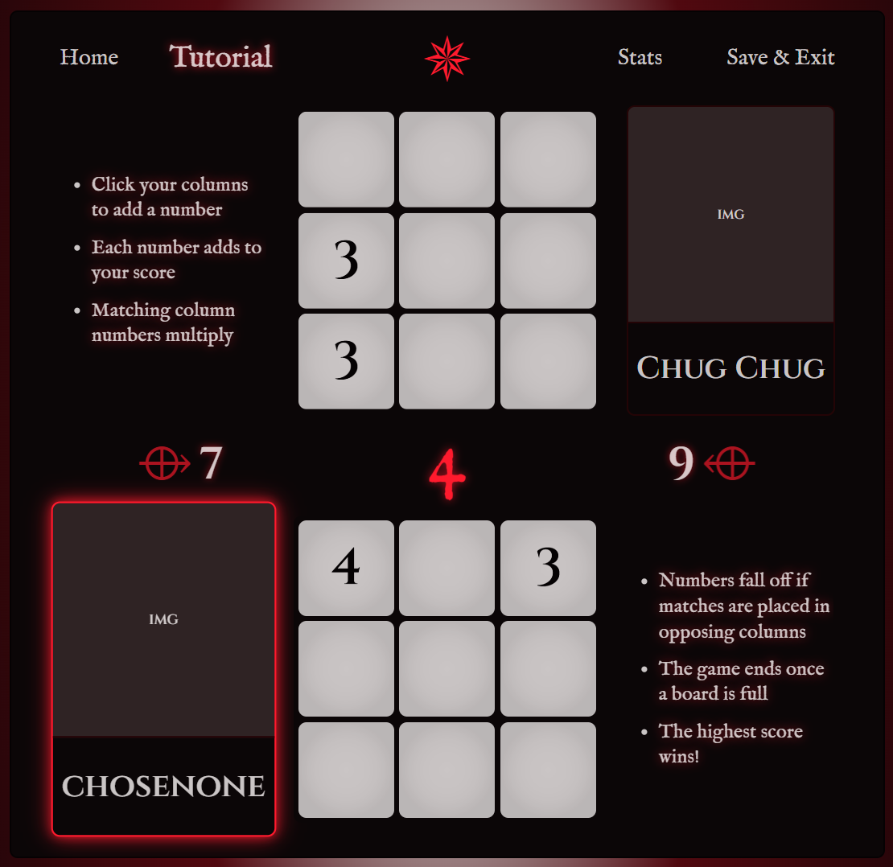

# GroovyBones

## Problem Statement
My goal with GroovyBones is to build a browser game recreation of the dice minigame 'Knucklebones' found in the game 'Cult of the Lamb'
(https://www.cultofthelamb.com/). The main problem is Knucklebones is a minigame and not conveniently accessed as a standalone game. Not to mention
Cult of the Lamb's unique ability to brick my entire Xbox which makes playing it risky. 

The desired outcome of GroovyBones is to allow a player to:
- Conveniently access GroovyBones (Knucklebones) publicly
- register and manage a player profile 
- play GroovyBones against a competitive game-logic opponent
- accumulate persistent player statistics to build their profile records

### How to Play

> - The game consists of two 3x3 boards, each belonging to their respective player.
> - The players take turns. On a player's turn, they roll a single 6-sided die, and must place it in a column on their board. A filled column does not accept any more dice.
> - Each player has a score, which is the sum of all the dice values on their board. The score awarded by each column is also displayed.
> - If a player places multiple dice of the same value in the same column, the score awarded for each of those dice is multiplied by the number of dice of the same value in that column. e.g. if a column contains 4-1-4, then the score for that column is 4x2 + 1x1 + 4x2 = 17.
> * **source:** https://cult-of-the-lamb.fandom.com/wiki/Knucklebones

### Constraints
- Knucklebones as a browser game will be missing some of the throughlines that make it exciting within 'Cult of the Lamb'
(mostly gambling aspects/rewards that carry over into the main game)

## Project environment:
- **Language**
  - Groovy 3.0.25
- **Framework**
  - Grails 6.2.3 w/embedded Tomcat
- **ORM Framework**
  - GORM 8.1.2
- **Database**
  - MySQL 8.4.6
- **Dependency/Build Management**
  - Gradle 7.6.4
- **Testing**
  - Spock
- **Logging**
  - SLF4J built-in/managed by Grails
- **CSS**
  - bootstrap
- **Validation**: 
  - Cognito hosted UI
  - TBD
- **Security/Authentication**
  - AWS Cognito
- **Hosting**
  - TBD, DigitalOcean Droplet or AWS
- **WEB SERVICE CONSUMED**
  - I'm creating an internal web service to route all user DB interactions through
    - _Not to be confused with Grails services/GORM_
    - Might include a split with game logic using Grails services while User logic using web services
    - Grails services can initiate game logic without latency while User services are HTTP

## Tech I'd like to Explore:
- Grails/Gradle/GORM is completely new as of this semester
- Docker/Docker Compose to address the different technology stack from class
- WebSockets for managing multiplayer instances